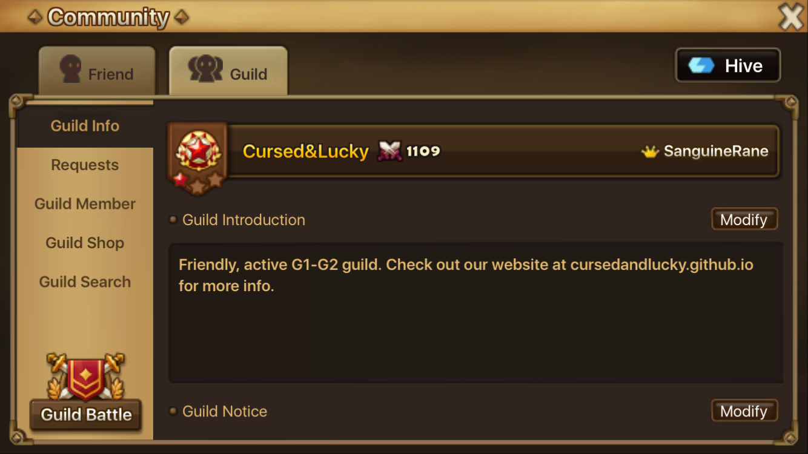
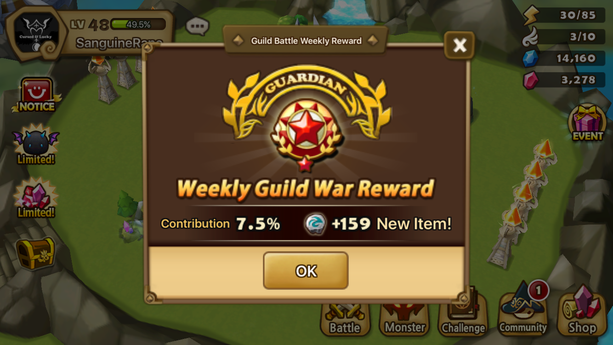
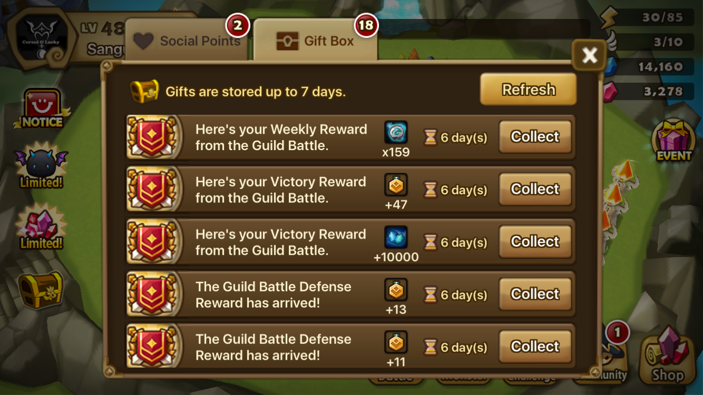
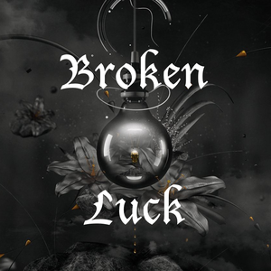

## About

We are an active semi-farming G1 guild.

<figure>
  
</figure>

## Battle Schedule

* Monday through Friday
  * Half defense set (3 monster team + 1 monster team)
  * 8:30am server time morning battle starts
  * 8:30pm server time evening battle starts
* Friday Evening (8:30pm server time)
  * Full defense set (both 3 monster teams)
* Saturday
  * 8:30am server time morning battle starts
  * 2:30pm server time evening battle starts

## Expectations

Everyone is expected to play fairly. Members are expected to have a good
understanding of battle mechanics, attack fairly, use their swords, and adjust
their defenses according to the above schedule. If you can't use your swords,
members are expected to let one of the officers know before the outage.

Each tower has a bonus point associated with it: +3, +2, +1, or none. Attacking
fairly means that on farming battles, never go above +6 collective bonus
points.

For battles that aren't obvious wins, members should attack towers for
percentage. Use your discretion and attack towers that you think you can win.
If sensible, always attack greens towers first, yellows next, and reds last.

If any of the above expectations aren't met, one of your officers may reach
out to you directly on Line and we may take you out the next guild battle.

## Communication

We use [Line](http://line.me/) for all guild communications. We have an active
group there where people joke around, chat about strategy, and hang out.

## Join The Team

You must finish F3+ in weekly arena rankings, have 15+ 6★s, and must agree to
follow the above expectations.

Contact <b>sanguinerane</b> (Darren) or <b>davk28</b> (Dave) on Line. We'll add
you to the Line group and then to the guild in-game (<b>Cursed&Lucky</b>).

Join and you'll be rewarded:
<figure>
  
  
</figure>

## Guild Picture

Show off your guild pride by setting this as your profile picture:

<figure>
  
</figure>
