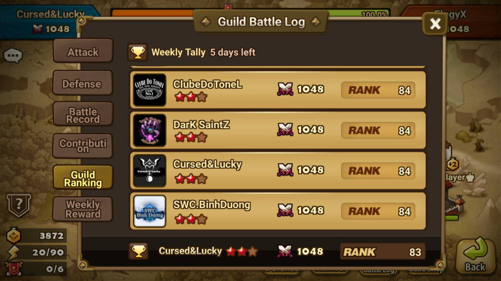

  <a href="https://discord.gg/PqMtvE3" class="btn">
    Join us on Discord
  </a>

## About

We are an active semi-farming G1-G2 guild.

<figure>
  
</figure>

## Ranking

Monday to Thursday, we farm at half defense. Thursday to Saturday, we set full
defense and surge in ranking. We finish either G1 or G2.

<figure>
  
</figure>

## Battle Schedule

<b>Guild battles start at midnight and noon Monday - Saturday.</b>

* Sunday
  * <b>Set half defense</b>
    * 3 monster team + 1 monster team
  * Battle registration
    * Half defense must be set before midnight in order to be included in the
      week's battle registration
* Thursday Evening
  * <b>Set full defense</b>
    * both teams are 3 monster teams
* Saturday
  * 10pm weekly guild war ends

<b>Note: All times are in server time. US & Canada Pacific Time Zone</b>

## Expectations

Everyone is expected to play fairly. Members are expected to have a good
understanding of battle mechanics, attack fairly, use their swords, and adjust
their defenses according to the above schedule. If you can't use your swords,
members are expected to let one of the officers know before the outage.

Each tower has a bonus point associated with it: +3, +2, +1, or none. Attacking
fairly means that on farming battles, never go above +6 collective bonus
points.

For battles that aren't obvious wins, members should attack towers for
percentage. Use your discretion and attack towers that you think you can win.
If sensible, always attack greens towers first, yellows next, and reds last.

If any of the above expectations aren't met, one of our officers may reach
out to you directly on Line and we may take you out the next guild battle.

## Communication

We use [Discord](https://discordapp.com/) for all guild communications. We have
an active group there where people joke around, chat about strategy, and hang out.

## Join The Team

You must finish F3+ in weekly arena rankings, have 15+ 6★s, and must agree to
follow the above expectations.

Join the [Broken Luck Discord Server](https://discord.gg/PqMtvE3). Once you're
there, we'll go over the rules with you and then add you to the guild.

## Rewards

Join and you'll be rewarded:
<figure>
  
  
</figure>

## Guild Picture

Show off your guild pride by setting this as your profile picture:

<figure>
  
</figure>
